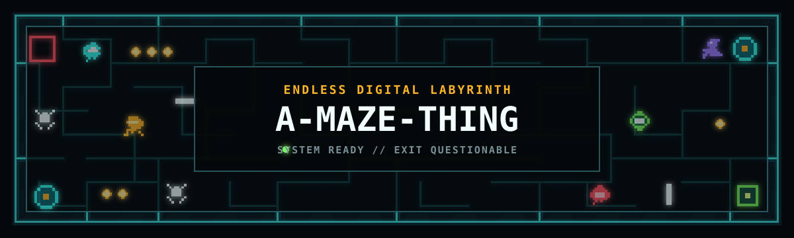
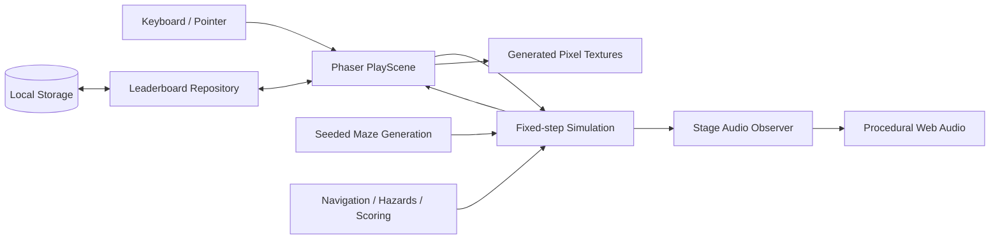

<div align="center">

<p><strong>Hoard coins. Read the maze. Avoid becoming a cautionary stain.</strong></p>
<p>
<a href="https://white-sea-06dd1bb10.7.azurestaticapps.net/"></a>


</p>
</div>

## Insert Coin

**A-Maze-Thing** is an endless, score-driven arcade labyrinth built from deterministic seeds. Every stage creates a new sparsely braided maze with alternate routes, suspicious dead ends, useful portals, optional riches, and a growing list of things that have noticed you.

Your assignment is refreshingly simple:

1. Leave **Start**.
2. Collect as many coins as courage permits.
3. Reach the **Exit**.
4. Do not let the maze collect *you*.

Movement continues until blocked, so decisions happen at junctions. The Hunter sleeps until your first move, then enters from Start after a short and frankly insufficient grace period. Clear a stage and the labyrinth expands; by Stage 50 it reaches `41x37`, with a tracking camera and no minimap to hold your hand.

> **LIVE ARCADE SIGNAL:** [Play A-Maze-Thing](https://white-sea-06dd1bb10.7.azurestaticapps.net/)

## How To Play

### Controls

| Signal | Action |
|---|---|
| Arrow keys / `WASD` | Queue your next direction at a legal junction |
| `Enter` / `Space` / click / tap | Select, confirm, or dismiss a briefing |
| `Escape` | Pause or return to the active run |
| `T` while paused | Retry the current stage from its starting state |
| `R` while paused or at game over | Retry the same seed from Stage 1 |
| `Enter` while paused or at game over | Start a new run |
| `L` on a menu | Open local scores |
| `M` / speaker button | Mute or restore procedural audio |

On the leaderboard, use Left / Right to change difficulty, Up / Down to select a score, and `Enter`, `Space`, or `R` to replay its seed. `C` clears the visible board after confirmation; `Escape` returns. Initials use three `A-Z` characters and can be typed or adjusted with the arrow keys.

### Pick Your Poison

| Mode | Official safety assessment |
|---|---|
| **CASUAL MODE** | All maze, no menace. No coins, enemies, traps, lives, or portals. The walls are the only thing judging you. |
| **EASY PEASY** | Full systems at half speed. Danger has been asked to walk. |
| **NORMAL** | Factory settings. The maze cheats only the approved amount. |
| **OVERCLOCKED** | Everything at 150%. Warranty status: extremely void. |

Normal is selected by default. Retrying a stage or seed preserves its difficulty; a new run returns to the selector.

### Maze Signals

| Signal | What it means |
|---|---|
| <span style="color:#42e8df">**CYAN**</span> | You, portals, and generally promising technology |
| <span style="color:#ffb629">**AMBER**</span> | Coins, warnings, and the maze politely clearing its throat |
| <span style="color:#ff5364">**CORAL**</span> | Active danger, closed shutters, and poor immediate prospects |
| <span style="color:#79f25f">**LIME**</span> | Exits, extra lives, and statistically rare good news |

### Things In The Dark

- **Coins** are optional. Collect every coin before escaping to trigger `COIN MONGER!` and double that stage's coin award.
- **Portals** hide in distant dead ends. They return you to Start; revisit Start to jump back to the last portal used. The rest of the maze does not pause for transit.
- **Extra Life** is guaranteed on Stage 2 when you have one life. Catch the evasive target to hold one reserve; later chances are scarce.
- **Spikes** telegraph in amber before becoming dangerous. Active spikes hurt you and temporarily block enemy routes.
- **Maze Shutters** arrive from Stage 6, sealing only loop shortcuts. Coral means reroute; an original path always remains.
- **The Ambusher** may wait in a deep branch from Stage 11. Reveal it, survive, and escape for `+25`.
- **The Wanderer** enters through the Exit from Stage 21. Keep your distance and escape while it remains for `+25`; get too close and it stops wandering.
- **The Hunter** follows from the entrance. It is patient, deterministic, and not open to mediation.

Runs begin with one life and can hold two. Losing a reserve resets you and the Hunter while preserving collected coins and the hazard clock. Losing the final life ends the run. Easy Peasy, Normal, and Overclocked each maintain a browser-local top ten ranked by coins, then stage, then earliest result. Scores and initials never leave your browser.

## Power Up Locally

### Requirements

- [Node.js 24](https://nodejs.org/) (`>=24 <25`)
- npm 11 (the repository pins `npm@11.9.0`)

```powershell
git clone <repository-url>
cd a-maze-thing
npm ci
npm run dev
```

Vite will print the local arcade URL, normally `http://localhost:5173`.

| Command | Function |
|---|---|
| `npm run dev` | Start the Vite development server |
| `npm test` | Run the deterministic Vitest suite once |
| `npm run build` | Type-check and create a production build in `dist/` |
| `npm run preview` | Serve the production build locally |

No API keys, database, downloaded game art, or audio assets are required. Browser storage is used only for mute preference and local leaderboards.

## System Blueprint

The project keeps deterministic simulation away from rendering concerns. Phaser is the cabinet; the game rules are the machinery behind the glass.



| Sector | Responsibility |
|---|---|
| `src/generation/` | Seeded PRNG, maze carving and braiding, endpoints, portals, coins, enemies, spikes, and shutters |
| `src/game/` | Framework-independent simulation, movement, navigation, scoring, progression, difficulty, seeds, and leaderboards |
| `src/audio/` | Simulation observation, persistent settings, and the application-scoped procedural Web Audio engine |
| `src/scenes/` | Phaser input, camera, menus, HUD, and rendering adapter |
| `src/presentation/` | Original pixel patterns, generated textures, legend, and player-facing messages |

### Technology Stack

- **TypeScript 6** for strict, explicit game logic
- **Phaser 4** for browser rendering, input, cameras, and scene orchestration
- **Vite 8** for development and production builds
- **Vitest 4** for deterministic unit and simulation tests
- **Web Audio API** for a fully procedural soundtrack and cues
- **Azure Static Web Apps** for the live build

Game state advances in fixed `1/120` second steps while Phaser renders at the browser frame rate. The deterministic modules do not depend on Phaser, which keeps generation and simulation fast to test and reproducible outside the scene.

### Runtime Route

1. A run seed and stage number derive the stage seed.
2. The generator carves a perfect-maze foundation, then adds controlled loops and endpoints.
3. Seeded placement modules add coins, portals, hazards, and eligible enemies without invalid overlaps.
4. The framework-independent simulation resolves queued movement, collisions, pursuit, scoring, and timed blockers.
5. `PlayScene` projects that state into pixel sprites, overlays, a fixed HUD, and a player-following camera.
6. `StageAudioObserver` translates meaningful state changes into procedural cues without changing simulation timing.

## Deterministic Runs

Share or replay a complete run by adding a decimal or hexadecimal seed and a canonical difficulty:

```text
http://localhost:5173/?seed=4271&difficulty=normal
http://localhost:5173/?seed=DEADBEEF&difficulty=overclocked
```

Supported difficulties are `casual`, `easy-peasy`, `normal`, and `overclocked`. Maze geometry is identical across difficulties; the selected mode changes active systems and simulation speed. The same seed, difficulty, stage, and retained-life state reproduce the same run.

For generator inspection, enable maze debug signals:

```text
http://localhost:5173/?seed=DEADBEEF&debug=maze
http://localhost:5173/?seed=DEADBEEF&difficulty=casual&debug=maze&stage=50
```

`debug=maze` highlights escape-loop paths, newly opened passages, and loop coin anchors. The `stage` override accepts a positive stage only while debug mode is active. Debug mode defaults to Easy Peasy timing and skips the difficulty selector unless a difficulty is explicit.

## Maze Escalation

| Stages | Size progression | New concerns |
|---|---|---|
| 1-10 | `11x7` to `17x13` | Core pursuit, Extra Life, shutters |
| 11-20 | Up to `23x19` | Longer loops, eligible Ambushers |
| 21-30 | Up to `29x25` | Wanderers and larger scrolling worlds |
| 31-40 | Up to `35x31` | Denser interacting routes and more shutters |
| 41-50 | Up to the `41x37` cap | Maximum pre-cap scale |
| 51+ | Remains at `41x37` | Deterministic compact-loop, long-loop, and endpoint variants |

Later mazes retain useful dead ends while adding junctions and interacting loops. Full-game stages beyond 50 also rotate hazard density. Casual Mode keeps only the maze, Start, Exit, and player at every stage.

## Audio Protocol

All sound is synthesized at runtime. There are no streamed tracks or external sound files. The maze pulse moves from calm to pursuit and danger as threats activate; coins, portals, alerts, lives, and results use short procedural signals. Nearby hazards pan toward their source and matching simultaneous cues are combined to keep late stages readable.

Browsers unlock audio after the first keyboard or pointer gesture. `M` and the speaker control toggle mute, and the preference persists locally. Menus and interruptions suspend the pulse without replaying missed cues or disturbing deterministic time.

## License

Licensed under the [MIT License](LICENSE). Enter freely. Exit availability may vary.
